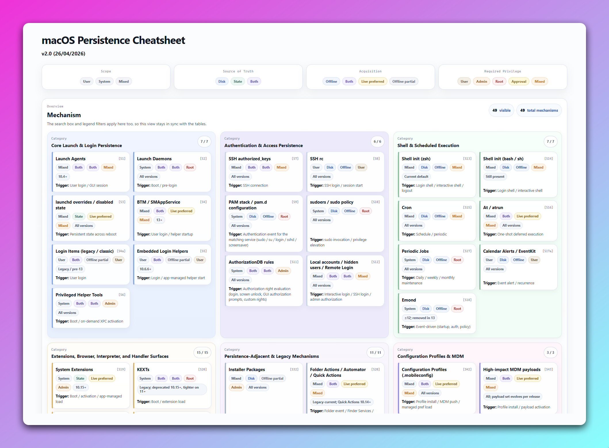
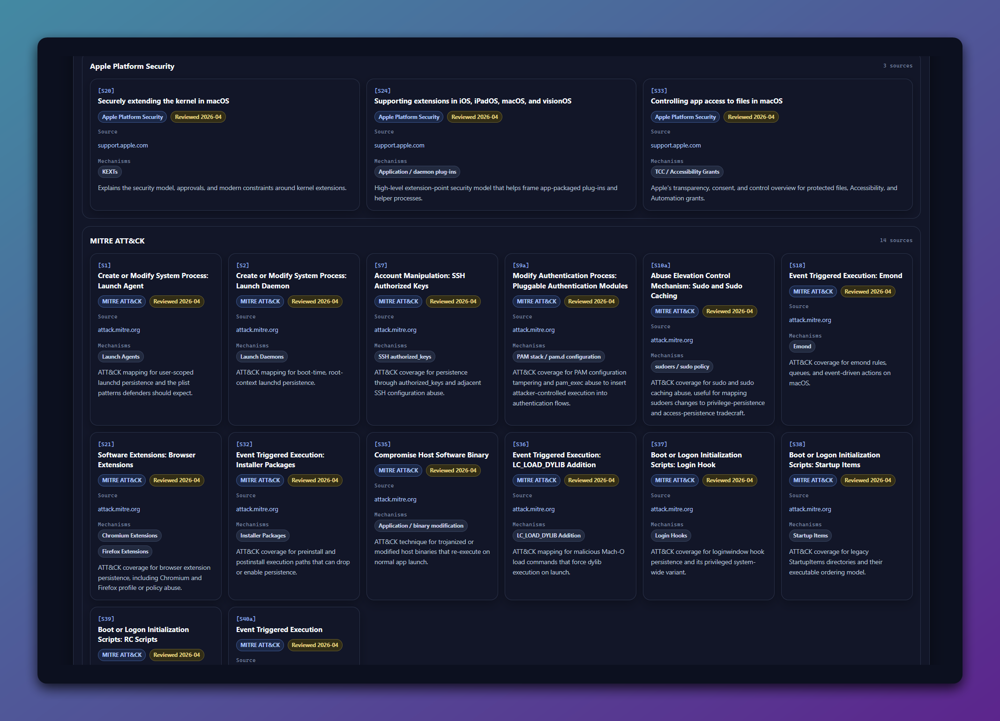

# macOS Persistence Cheatsheet

A practical DFIR-focused cheatsheet for identifying, triaging, and reviewing macOS persistence mechanisms. With additional context such as scope, required privilege, source of truth, signal level, false-positive risk and review guidance.

## Features

- Light & dark theme.
- Covers 39 macOS persistence mechanisms across core launch, shell and scheduled execution, extensions and handlers, adjacent and legacy techniques, and profiles / MDM.
- Includes search and interactive legend filters to quickly narrow mechanisms by scope, required privilege, source of truth, signal, and false-positive risk.
- Provides quick navigation, reading/compact density modes, and a focus mode.
- Includes a synchronized mechanism overview to scan all documented techniques at a glance.
- Documents artifact paths, collection and triage notes, execution triggers, and review guidance for each mechanism.

## Official page

- [macOS Persistence Cheatsheet](https://jaybird1291.github.io/blog-cyber/posts/macos-persistence-cheatsheet/)

## Current version

The current published version is `v2.0` dated `2026-04-26`.

Assets currently present in the repository:

- `macos-persistence-cheatsheet-light-v2.0.html`
- `macos-persistence-cheatsheet-dark-v2.0.html`
- `macOS Persistence Cheatsheet Light v2.0.pdf`
- `macOS Persistence Cheatsheet Dark v2.0.pdf`

### v2.0 changelog

### Summary

- Major public release update from `v1.2.1 (14/04/2026)` to `v2.0 (26/04/2026)`.
- Expanded the cheatsheet from `39` to `49` mechanisms with `10` new mechanism rows and no removals.
- Reworked the model from Signal / False Positive Risk scoring toward acquisition-aware DFIR triage.
- Added a maintainable, JS-generated `Sources & References` bibliography with clickable `[Sx]` references.

## Version history

- `v1.2.1` (`2026-04-14`): code cleanup
- `v1.2` (`2026-04-08`): expanded coverage from 31 to 39 mechanisms and refreshed the visual design
- `v1.1` (`2026-04-08`): UI polish, improved scroll behavior, focus mode cleanup, and overview badge fixes
- `v1.0` (`2026-04-07`): initial published version

## Contributing

Contributions are welcome through issues and pull requests.

You can help by reporting inaccuracies, suggesting missing persistence mechanisms, improving triage guidance etc.

Please try to keep contributions:
- practical and technically accurate 
- concise and consistent with the current structure
- synchronized across versioned and published assets when relevant

